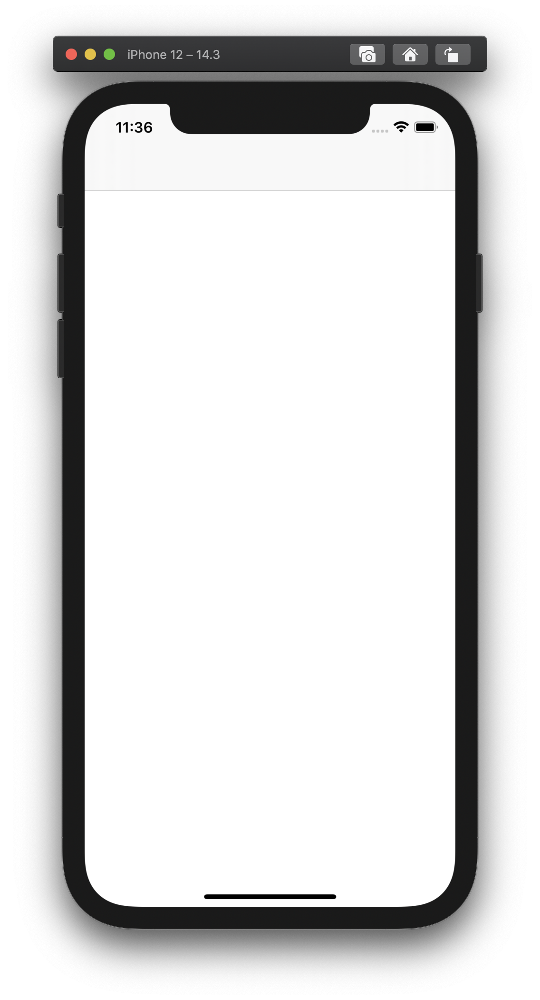
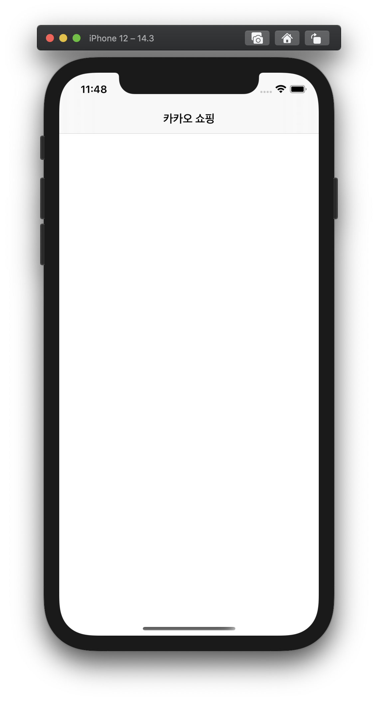
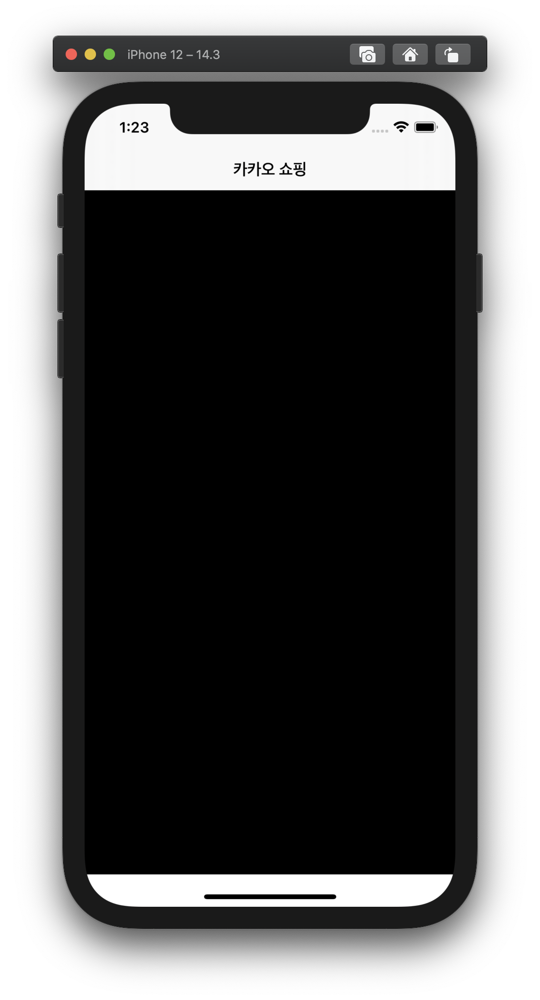
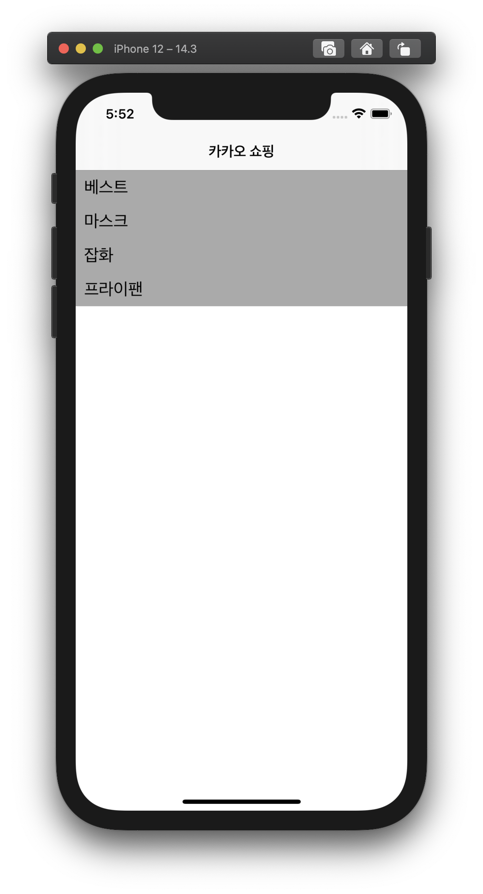
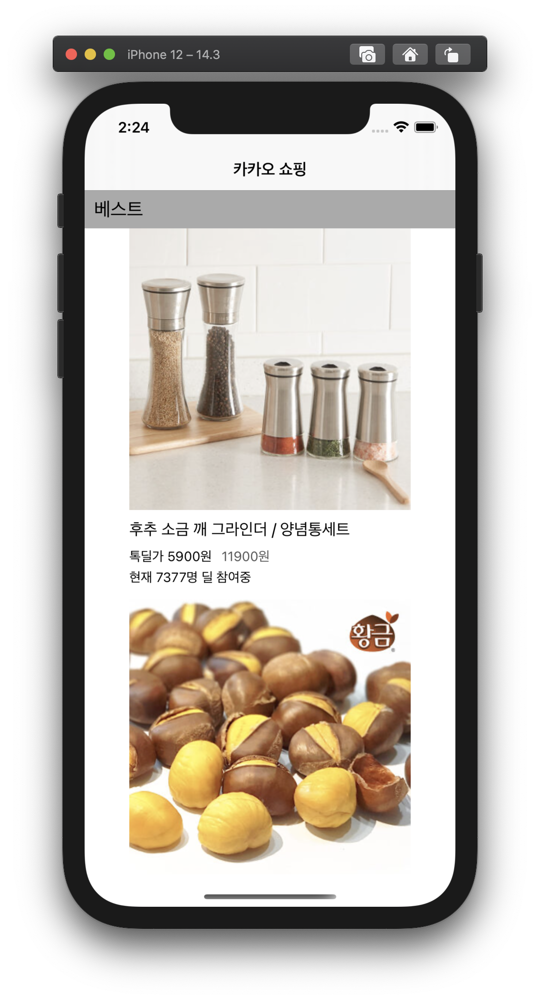
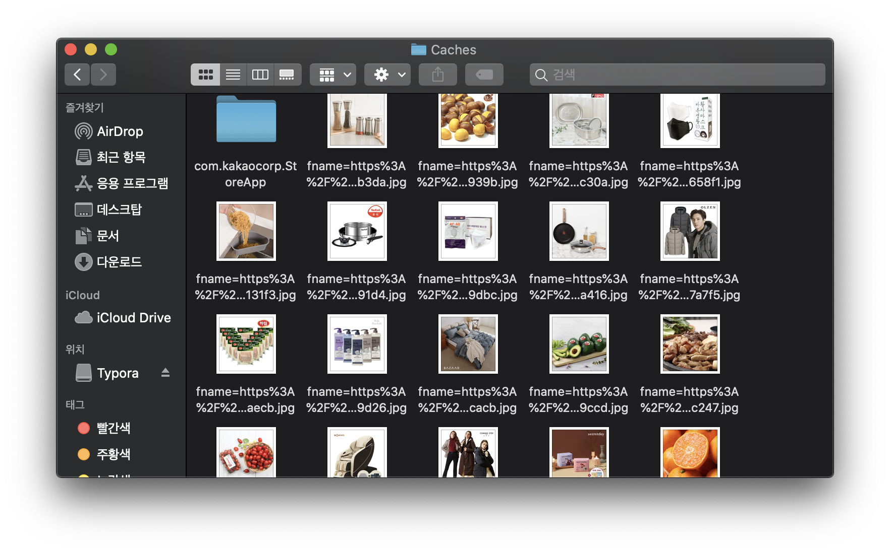

# swift-w5-shopping
모바일 5주차 쇼핑 저장소

### 초기 세팅 0201 11:30

- 프로젝트 clone
- .gitignore 생성
- 프로젝트 생성

### 네비게이션 컨트롤러 생성 0201 11:35

- 네비게이션 컨트롤러 생성

### Model, View, Controller, Util 그룹 생성 0201 11:48

- 각 그룹 생성
- 컨트롤러 이름 변경 ViewController -> MainViewController
- 네비게이션아이템 title 추가

### CollectionView 생성 0201 13:25

- colletionView의 layout 설정(item, group, section 설정)
- shoppingListView에 오토레이아웃 적용

### JsonModels 생성 0201 17:05

- StoreItem 구조체 생성

### CollectionView layout 설정 및 header 추가 0201 17:55

- supplementary view로 header 추가

### HTTP 요청 받기 : 0201 1000

- http요청을 받는 loadData 메소드 구현

### HTTPRequestManager 생성 0201 1020

- 네트워크 관리 객체(HTTPRequestManager 클래스) 생성
- ItemManager 클래스에 getItems, getCount, subscript메소드 추가

### 타입 이름 변경 0202 1030

- jsonPath -> ItemType

### 셀 정보 넣기 0202 1430

- ShoppingItemCell class 생성(xib도 생성)
- ProductImage, productName, groupDiscountPrice, originalPrice, groudDiscountUserCount outlet 연결 후 배치
- setCellData 메소드 추가
- HTTPRequestManager에 getImageURLString 메소드 추가

### MyFileManager 생성 0202 17:00

- MyFileManager Class 생성
- getImageDataFromCache, saveImageDataIntoCache, createFilePath 메소드 생성
- HTTPRequestManager의 getImageUsingURLString 메소드에서 바로 URL을 타고 Image를 가져오는 것이 아니라 MyFileManager를 통해 Cache에 해당 image가 있는지 확인 후 없는 경우에면 URLSession을 통해 가져오도록 수정

### Cell touch에 반응 0202 18:00

- StoreItem에 storeDomain, productId 추가
- ShoppingItemCell에 변수 추가 : storeDomain, productId
- gestureRecognizer 등록, 터치 시 NotificationCenter를 통해 cellTouched post
- MainViewController를 observer로 등록

### JsonModel 추가 0202 20:35

- json을 struct로 변환해주는 사이트를 통해 `https://store.kakao.com/a/{storeDomain}/product/{productId}/detail`에서 받아오는 json 형태에 맞는 구조체 추가

### JsonHandler 분리 0203 11:00

- JsonHandler 클래스 생성
- parse 메소드 추가

### dataTesk 변경 0203 13:20

- getImageUsingURLString에서 dataTask를 사용하던 부분을 downloadTask를 사용하도록 변경
- MyFileManager 클래스에 copyImageDataIntoCache 메소드 추가

### FileManager 프로토콜 생성 0203 13:30

- FileManagerProtocol.swift 생성
- MyFileManager클래스에서 프로토콜 채택
- HTTPRequestManager에서 프로토콜 참조

### StringMaker 생성 0203 13:50

- Util group에 StringMaker.swift -> StringMaker 클래스 생성
- makeGroupDiscountedPriceString, makeOriginalPriceString, makeGroudDiscountUserCountString 메소드 추가

### sectionTitle 옮기기 0203 17:00

- 뷰컨트롤러에서 직접 String 배열을 만들어서 사용하지 않고 ItemType enum 타입에서 직접 SectionName을 가져올 수 있도록 수정

### Commit 0203 11:30

- DetailViewController 추가
- DetailManagerProtocol 추가
- ItemOrderProtocol 추가
- DetailView 추가
- Detail 페이지 파싱하는 코드 추가

### Json Model 수정 0204 10:00

- Notice struct 추가
- notice를 [JSONAny]가 아닌 [Notice]로 수정
- TalkDeal struct 추가
- DataClass에 talkDeal 속성 추가

### DetailView 화면 구성

- 스토리보드 수정
- StringMaker에서 ViewHelper로 파일 이름 변경 후 ShoppingItemCellStringMaker, DetailViewStringMaker, DetailViewLogicHelper로 클래스 분할
- 뷰에서 정보를 얻어서 가공하는 역할을 하는 메소드 추가
- 뷰 오토레이이아웃 설정
- 웹 뷰 가져와서 띄우기

### Json Model 분리 0204 20:50

- StoreItem과 DetailItem으로 분리

### StoreItemManager 변경

- StoreItemManagerProtocol 생성
- StoreItemManager가 프로토콜 채택 후 메소드 static에서 일반 메소드로 변경
- StoreItemManager의 static method를 사용하던 부분에서 StoreItemManagerProtocol을 참조하도록 수정

### DetailViewController observer 등록 시기 변경

- viewDidLoad에서 observer를 등록하던 기존의 코드의 문제점(처음 저장되는 데이터를 View가 받아들이지 못하는 문제)을 해결하기 위해 MainViewController에서 DetailViewController 인스턴스를 생성할 때 observer를 등록하는 코드로 수정

### Get 메소드들을 computed property로 변경

- DetailItemManagetProtocol의 get method들을 only gettable property로 변경
- DetailItemManager의 get method들을 computed property로 변경
- get method를 사용하던 코드 수정

### HTTPRequestManager 메소드 수정

- URLSession을 통해 받아온 data를 바로 JsonDecoder를 통해 가공하는 형식이 아니라 받아온 data를 넘겨주고 completionHandler에서 data를 가공할 수 있도록 수정

